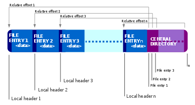

 

# [APPNOTE.TXT](https://capturetheflag.withgoogle.com/challenges/misc-appnote)

### "Every single archive manager unpacks this to a different file..."

 

The Challenge: 

We get a zip file called "dump.zip".

Exploring this file with archive manager and we find this file : "hello.txt"

And inside:
**"There's more to it than meets the eye..."**

 

# Let's Explore This File

*The size of this file is really large ... 
 (61kb for dump.zip)* 

Opening this file with HEX editor we can find some interesting info...

 

First thing to catch is another file called "hi.txt"

straight after the name of the file, the content appear: 
**"Find a needle in the haystack"**

Exploring the decoded text, the string "flagXXY"
can be found (XX are numbers from 0 to 18 and Y is some char).

I'm using C as a tool to decode this, and the script can be found here, [script](reader.c).

getting the char Y (from flag XXY) we get this(repeating few times):

abcdefghijklmnopqrstuvwxyz{CTF0137}_

This may be a dictionary for our flag...

# ZIP files

ZIP file is composed of few sections:

* File Header starting with signature '\x50\x4b\x03\x04' (LFH)
* Central directory file header with signature '\x50\x4b\x01\x02' (CDF)
* End of central directory record '\x50\x4b\x05\x06' (EOCD)

Counting signatures we get 686 LFH and CDF and only 21 EOCD.

21 ~ The number of characters in the flag, we can assume the EOCD can give us the way to find the flag.

The structure of EOCD contains Offset of cd wrt to starting disk this will give the correct way to the info in this file.

Iterating through we collect the offsets in array to reveal the offset to the correct LFH, then we find 4 bytes (ignore them) in the first and last LFH and 1 byte in the others, converting this the ascii we get this flag: 

**CTF{p0s7m0d3rn_z1p}**